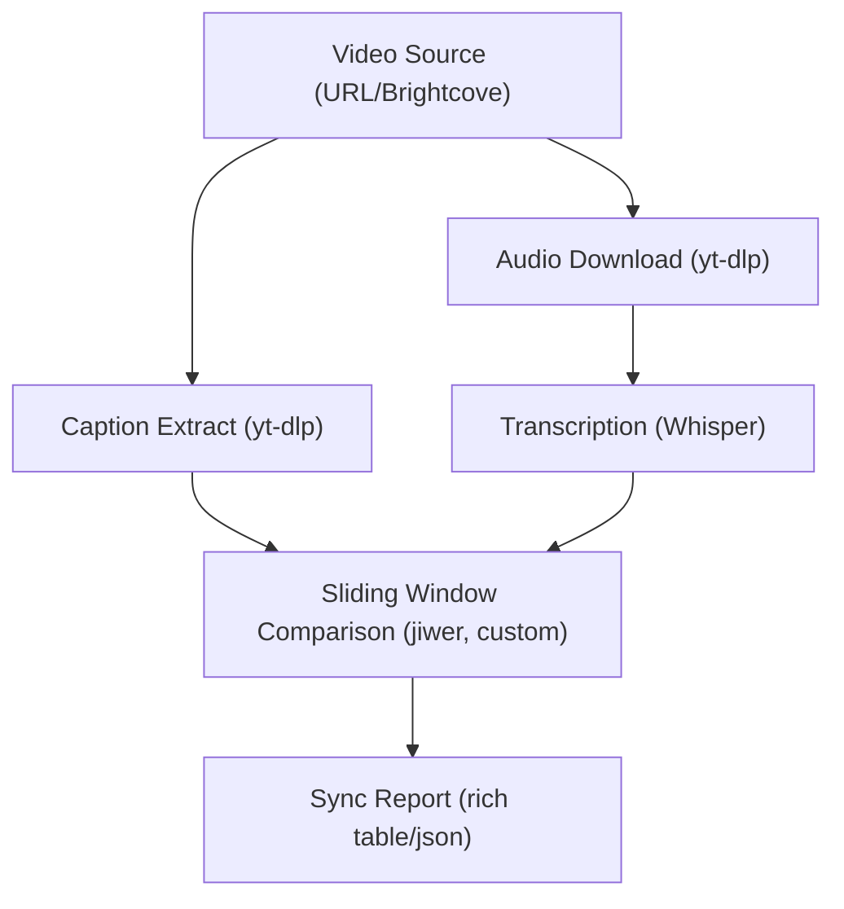
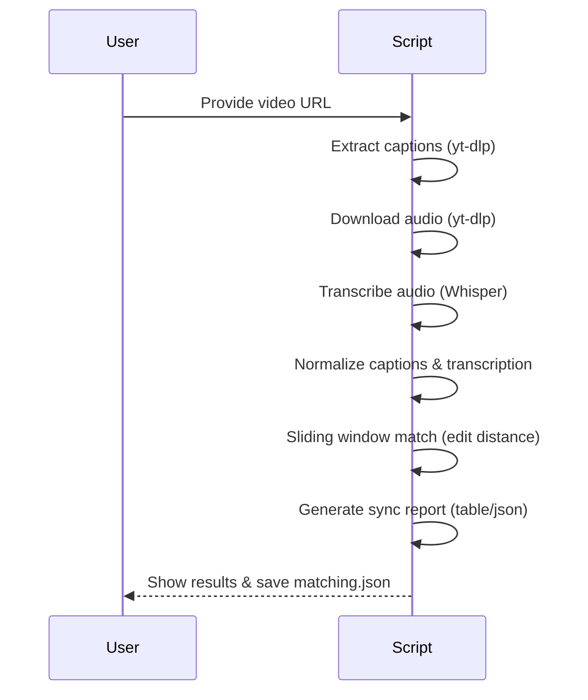

# Transcription Validator

## Overview

**Transcription Validator** is a Python tool that downloads a video (e.g., from Brightcove), extracts its captions, transcribes the audio using Whisper, and compares the original captions to the transcribed text using advanced normalization and sliding window matching. It provides a detailed report of caption/audio sync and matching accuracy.

---

## Architecture Diagram



---

## Flow Diagram



---

## Functionality
- **Extracts captions** from online videos (supports Brightcove, YouTube, etc.)
- **Downloads audio** and transcribes it using OpenAI Whisper (via faster-whisper)
- **Normalizes** both captions and transcription for fair comparison (removes punctuation, special chars, etc.)
- **Matches** each caption to the best-matching window in the transcription using edit distance (WER)
- **Reports** detailed accuracy, offset, and error metrics for each caption
- **Outputs** a rich table and saves results as `matching.json`

---

## How to Use

1. **Clone the repository and install dependencies:**
   ```sh
   git clone <repo-url>
   cd transcription-validator
   python3 -m venv venv
   source venv/bin/activate
   pip install -r requirements.txt
   ```

2. **Run the tool:**
   ```sh
   python video_transcriber.py <VIDEO_URL>
   ```
   - If we dont provide <VIDEO_URL>, by default, the script uses a sample Dell Brightcove video URL. You can edit `main()` in `video_transcriber.py` to use your own URL.

3. **View the results:**
   - The tool prints a color-coded table to the terminal showing each caption, its normalized form, the best-matching transcribed text, accuracy, offset, and error details.
   - Results are also saved to `matching.json` for further analysis.

---

## Data Flow Explanation

1. **Input:**
   - The user provides a video URL (e.g., Brightcove, YouTube).

2. **Caption Extraction:**
   - The tool uses `yt-dlp` to extract English captions (VTT/SRT) from the video source.

3. **Audio Download:**
   - The tool downloads the best available audio stream using `yt-dlp` and saves it as an MP3 file.

4. **Transcription:**
   - The audio is transcribed using the Whisper model (via `faster-whisper`), producing a list of words with timestamps.

5. **Normalization:**
   - Both the original captions and the transcribed text are normalized (lowercased, punctuation and special symbols removed, spoken forms for URLs, etc.).

6. **Sliding Window Matching:**
   - For each normalized caption, a window of the same length slides over the normalized transcription.
   - The tool computes the word error rate (WER) for each window and selects the window with the highest accuracy (lowest edit distance) as the best match.

7. **Reporting:**
   - The tool generates a rich table showing:
     - Original and normalized captions
     - Best-matching transcribed text
     - Accuracy, offset, and error details (substitutions, deletions, insertions)
   - Results are also saved as a JSON file for further review.

---

## Outcome
- **Detailed Sync Report:**
  - For each caption, you get a clear view of how well it matches the actual spoken words in the video.
  - The report highlights perfect, good, fair, and poor matches, making it easy to spot issues.
- **JSON Output:**
  - The `matching.json` file contains all results for programmatic analysis or integration with other tools.
- **Use Cases:**
  - Caption quality validation, accessibility audits, subtitle QA, and more.

---

## Example Output

```
┏━━━━━━━━━━━━━━━┳━━━━━━━━━━━━━┳━━━━━━━━━━━━━━━━━━━━━━━━━━━━━━━━━━━━━━━━━━┳━━━━━━━━━━━━━━━━━━━━━━━━━━━━━━━━━━━━━━━━━┳━━━━━━━━━━━━━━━━━━━━━━━━━━━━━━━━━━━━━━━━━━┳━━━━━━━━━━━━┳━━━━━━━━━━━━┳━━━━━━━━━┳━━━━━━━━━━━━━┓
┃ Caption Start ┃ Caption End ┃ Original Caption                         ┃ Normalized Original                     ┃ Transcribed (Whisper)                    ┃ Accuracy % ┃ Offset (s) ┃ Status  ┃      Errors ┃
┡━━━━━━━━━━━━━━━╇━━━━━━━━━━━━━╇━━━━━━━━━━━━━━━━━━━━━━━━━━━━━━━━━━━━━━━━━━╇━━━━━━━━━━━━━━━━━━━━━━━━━━━━━━━━━━━━━━━━━╇━━━━━━━━━━━━━━━━━━━━━━━━━━━━━━━━━━━━━━━━━━╇━━━━━━━━━━━━╇━━━━━━━━━━━━╇━━━━━━━━━╇━━━━━━━━━━━━━┩
│          0.00 │        7.84 │ Here's how to update drivers on your     │ heres how to update drivers on your     │ heres how to update drivers on your      │      100.0 │       0.76 │ PERFECT │ S:0 D:0 I:0 │
│               │             │ PowerEdge                               │ poweredge server using a dell update    │ poweredge server using a dell update     │            │            │         │             │
│               │             │ server using a Dell Update Package, or   │ package or dup dot                      │ package or dup dot                       │            │            │         │             │
│               │             │ DUP.                                     │                                         │                                          │            │            │         │             │
└───────────────┴─────────────┴──────────────────────────────────────────┴─────────────────────────────────────────┴──────────────────────────────────────────┴────────────┴────────────┴─────────┴─────────────┘
```

---

## Output Table Column Explanation

- **Caption Start**: Start time of the caption in the video (seconds).
- **Caption End**: End time of the caption in the video (seconds).
- **Original Caption**: The original caption text as extracted from the video.
- **Normalized Original**: The cleaned/normalized version of the original caption for fair comparison.
- **Transcribed (Whisper)**: The best-matching segment from the Whisper transcription.
- **Accuracy %**: Percentage of words in the caption that match the transcription (after normalization).
- **Offset (s)**: Time difference between the caption's start and the start of the best-matching transcribed segment (seconds).
- **Status**: Match quality category (PERFECT, GOOD, FAIR, POOR).
- **Errors**: Edit distance breakdown: S=substitutions, D=deletions, I=insertions.

---

## License
MIT 

## Comparison & Matching Details

### Offset Calculation
- **Offset (s)** in the output table represents the time difference (in seconds) between when a caption is supposed to start (according to the original captions) and when the best-matching segment of the transcribed audio actually starts (according to the Whisper transcription).
- It is calculated as:
  
  ```python
  Offset = spoken_start - caption['start']
  ```
- A positive offset means the transcribed audio starts after the caption's expected start time; a negative offset means it starts before.

### Edit-Distance Technique (Word Error Rate)
- The tool uses the [jiwer](https://github.com/jitsi/jiwer) library to compute the word error rate (WER) between the normalized caption and the best-matching segment of the transcription.
- WER is calculated as:
  
  ```
  WER = (S + D + I) / N
  ```
  where S = substitutions, D = deletions, I = insertions, N = number of words in the reference.
- The tool reports the number of substitutions, deletions, and insertions for each caption.

### Text Cleaning for Matching
- Before comparison, both the original captions and the transcribed text are normalized using a `clean_text` function.
- This function:
  - Converts text to lowercase
  - Replaces or removes special characters and symbols (e.g., "." becomes " dot ", "/" becomes " slash ", etc.)
  - Removes filler words ("um", "uh", etc.)
  - Normalizes whitespace
  - Handles URLs and domains to spoken forms
- This normalization ensures that minor formatting or punctuation differences do not affect the matching accuracy.

### Sliding Window Approach
- For each caption, the tool uses a sliding window over the full transcription to find the best-matching segment.
- The window size is based on the number of words in the normalized caption.
- For each possible window, the tool computes the WER and selects the window with the highest accuracy as the best match.
- This approach allows for robust matching even if the timing or segmentation between captions and transcription is not perfectly aligned.

--- 